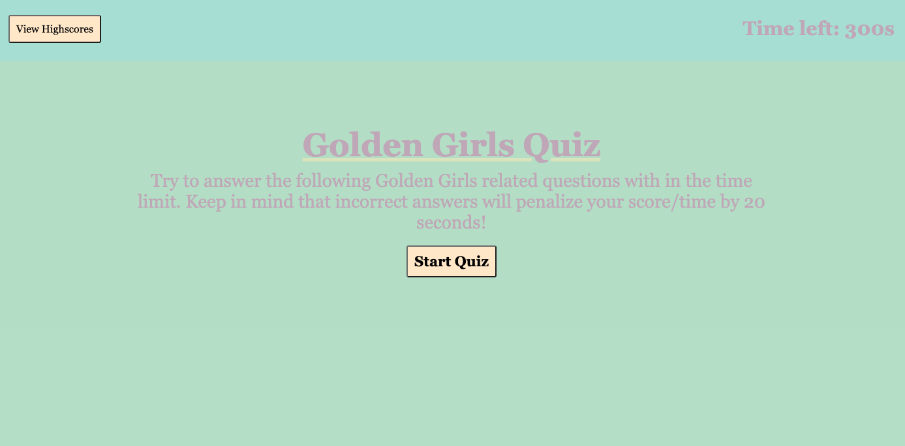

# Golden Girls Quiz

## Decsription

For Module #4's challenge we were tasked with creating a dynamically updated quiz using JavaScript and built-in browser API's. Originally we were to create a quiz about JavaScript facts, but our intstructor told us we had creative freedom and could make it about anything we wanted (within reason). Using what we have been learning these past few weeks and some Google searches, I was able to create a quiz about the Golden Girls that meets the below criteria:

### User Story

```
AS A Golden Girl fan
I WANT to take a timed quiz that stores high scores
SO THAT I can gauge how much I know about the show
```

### Acceptance Criteria

```
GIVEN I am taking a quiz
WHEN I click the start button
THEN a timer starts and I am presented with a question
WHEN I answer a question
THEN I am presented with another question
WHEN I answer a question incorrectly
THEN time is subtracted from the clock
WHEN all questions are answered or the timer reaches 0
THEN the game is over
WHEN the game is over
THEN I can save my initials and my score
```


## Usage

When you first open the site, you will be met with the page below. Once you click the start button multiple choice questions will appear and the timer will start counting down from 300 seconds. When you choose one of the choices the next question will appear aswell as a brief message below telling you if you got the previous question right or wrong. If you get the question wrong the timer will automatically deduct 20 seconds and the quiz will end once all questions are answered or the timer has run out. The remaining time will be your score, which you can then save by entering your initials and clicking the save button. If you click the view highscores button in the top left you will be brought to a page that lists the top 5 scores along side the initials of who got the score. 



## License

Please refer to the LICENSE in the repo.


## Links

Deployed Page: https://anjaliroland.github.io/M4-WebAPIs-Quiz/

Repository: https://github.com/anjaliroland/M4-WebAPIs-Quiz
